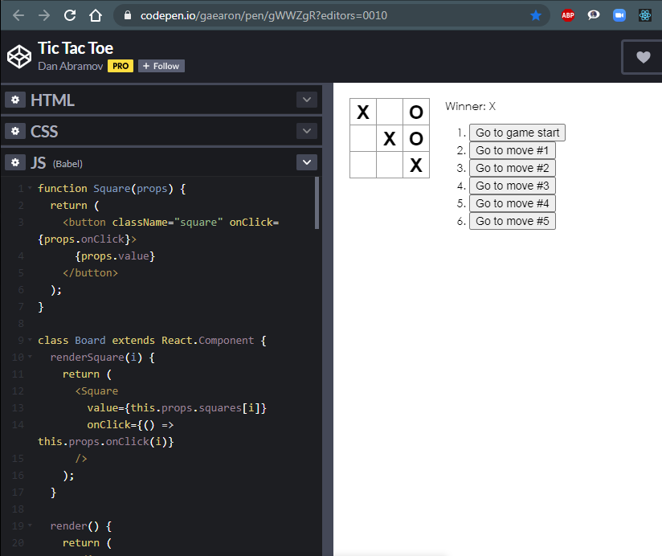

# Посібник: знайомство з React
>
[посібник](https://uk.reactjs.org/tutorial/tutorial.html)
>
### Даний посібник не потребує попереднього ознайомлення з React.
>
>
У цьому посібнику ми розглянемо створення **інтерактивної гри в хрестики-нулики** за допомогою React.
>
Кінцевий результат ви можете розглянути за наступним посиланням: [Завершена гра](https://codepen.io/gaearon/pen/gWWZgR?editors=0010). Мета даного посібника — допомогти вам зрозуміти React і його синтаксис.
>
Ми радимо уважно роздивитися гру перед тим як продовжувати працювати над посібником. Одна з її помітних властивостей — пронумерований список з правої сторони ігрового поля. Цей список відображає історію всіх ходів і оновлюється по ходу гри.
>
>

